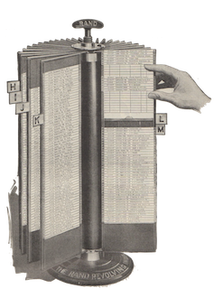

[](https://travis-ci.org/hrbrmstr/msgxtractr)
[](https://ci.appveyor.com/project/hrbrmstr/msgxtractr)
[](https://codecov.io/gh/hrbrmstr/msgxtractr)



`msgxtractr` : Read Outlook '.msg' Files

'Microsoft' 'Outlook' messages can be saves in '.msg' files. Tools are provided that enable extraction of metadata, envelope, headers, body and attachments from these files.

The following functions are implemented:

- `read_msg`	Read an Outlook '.msg' file into a data frame

### Installation

```{r eval=FALSE}
devtools::install_github("hrbrmstr/msgxtractr")
```

```{r message=FALSE, warning=FALSE, error=FALSE, include=FALSE}
options(width=120)
```

### Usage

```{r message=FALSE, warning=FALSE, error=FALSE}
library(msgxtractr)

# current verison
packageVersion("msgxtractr")

print(str(read_msg(system.file("extdata/unicode.msg", package="msgxtractr"))))
```

### Test Results

```{r message=FALSE, warning=FALSE, error=FALSE}
library(msgxtractr)
library(testthat)

date()

test_dir("tests/")
```

### Code of Conduct

Please note that this project is released with a [Contributor Code of Conduct](CONDUCT.md). By participating in this project you agree to abide by its terms.
